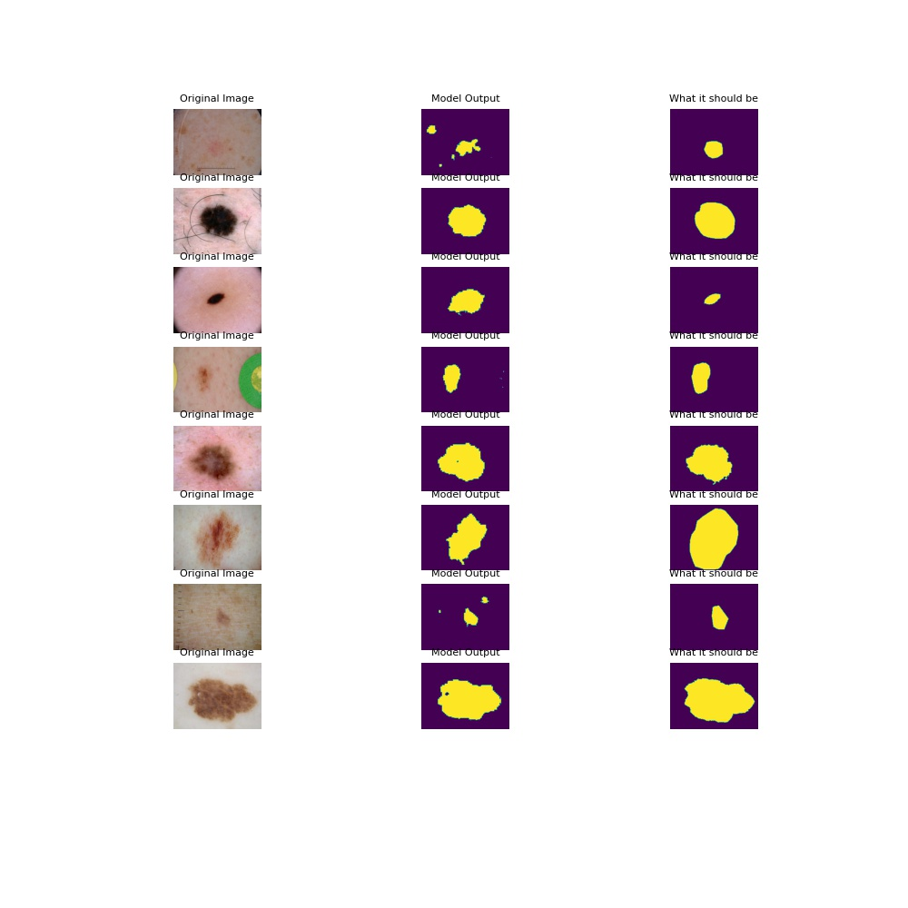
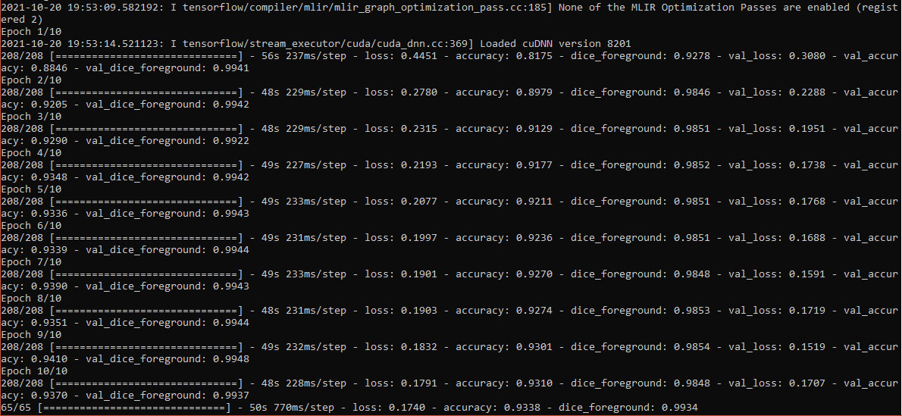
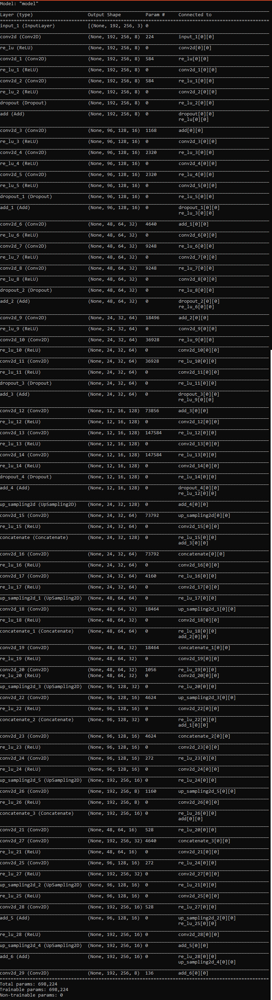

# Task 1 - Segment the ISICs data set with the Improved UNet

### Defined in Isensee et al. with all labels having a minimum Dice Similarity of 0.8 on the test set.  

## Dataset Information

The dataset used in this task is the ISICs 2018 dataset containing 2594 images and 12970 corresponding ground truth response masks. The challenge itself aims to improve melanoma diagnosis by investing in the development of deep learning and tasks individuals with developing algorithms and models which aid the diagnosis, detection and segmentation of melanoma. In this implementation and task, task 1 of the competition has been the focus whereby melanoma lesion segmentation is the goal with the output of the model having an average dice smilarity above 0.8 across predicted results. 

## UNET structure and Improved UNET

A typical UNET model structure can be found in image (XYZ) below. This image shows has 9 main blocks with each block having a different role across the model. Loosely the model can be broken into two categories, feature extraction and downsampling, and localisation and upsampling. Typically an input image is taken and progressively features are extracted unto a desired model depth (1024 filter depth in the image below) and then localisation occurs back to the starting filter level. An extraction and downsampling block involves two 3x3 Relu convolutions about the subject filter level followed by a downsampling layer (stride change or maxpooling). A typical localisation and upsampling block involves two 3x3 Relu convolutions followed by an up 2x2 convolution layer. The advantages of UNETs is the time to training and accuracy on image sets and are a good application to diagnostic imaging. 

The model implemented in this task is the improved UNET model taken from 
https://arxiv.org/abs/1802.10508v1
There are several key distincions made in this model relative to the typical UNET described above and figure (XYZ) shows this model. 
The key distinctions are concatenation blocks, to regulate neuronal learning and the use of LeakyRelu layers over Relu layers in a typical UNET to account for sparse gradients within imaging.

## Model Results

Below you will find example model output relative to predicted test sets as well as a graph of dice similarity vs epoch number. You will also be able to see the model summary showing different parts of the image relative to the standard improved UNET structure. This summary has been annotated to show the improved UNET aspects. 

## Depencies

### To use the project.py file (model generation)
The following libraries must be installed 

* Python 3.8.8
* Tensorflow 2.6.0

### To use the execute.py file (driver file)
The following libraries must be installed

* Python 3.8.8
* Tensorflow 2.6.0 -- includes keras
* numpy 1.19.5
* Scikit-learn 0.24.1
* Matplotlib 3.3.4
* Pillow 8.2.0

The execute script is dependant on the training images and ground truth images being downloaded and stored locally. These sets can be downloaded from the ISICs
website. The location of the sets must be referenced within the execute.py file script. 

#Usage

project.py

To use the improved UNET model the project.py file must be stored locally and imported within the file wishing to use the model. Following import the model can be referenced by using the UNET() funciton. 

example

import project as p

model = p.UNET()

The UNET() function returns a UNET model for use in the associated file. 

execute.py

To use the execute script all the libraries mentioned above must be installed the file can simply be called within as standard dos or linux setup using "execute.py" on the command line. This script will segment the training and ground truth sets into associated test, validation and training sets. It will create the model and it will then evaluate and return example output. 

# References

1) Isensee, F. et al., 2018. Brain Tumor Segmentation and Radiomics Survival Prediction: Contribution to the BRATS 2017 Challenge. Brainlesion: Glioma, Multiple Sclerosis, Stroke and Traumatic Brain Injuries, 10670, pp.287–297.

2) Hoorali, F., Khosravi, H. & Moradi, B., 2020. Automatic Bacillus anthracis 	bacteria detection and segmentation in microscopic images using UNet. Journal of microbiological methods, 177, p.106056.

3) Piao, S. & Liu, J., 2019. Accuracy Improvement of UNet Based on Dilated  Convolution. Journal of physics. Conference series, 1345(5), p.52066.
  